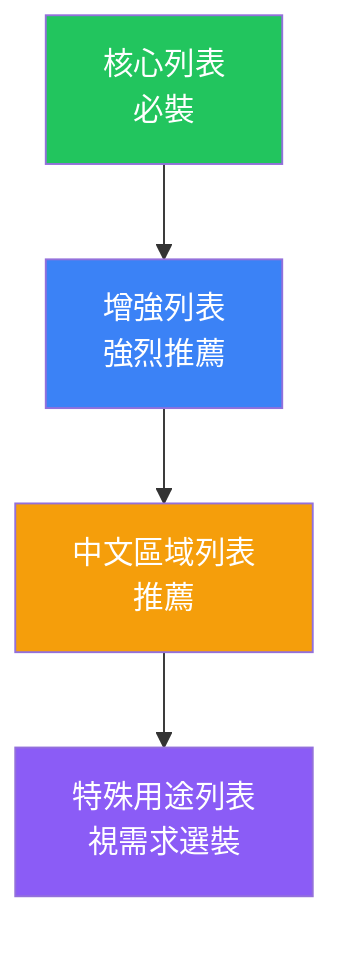

# NextDNS 阻擋列表推薦方案

> 分析日期：2026-04-02
> 分析對象：`nextdns/blocklists` 倉庫中的 84 個阻擋列表

---

## 篩選標準

| # | 需求 | 說明 |
|---|------|------|
| 1 | ✅ 阻擋廣告 | 封鎖網頁、應用程式中的廣告域名 |
| 2 | ✅ 阻擋惡意追蹤 | 封鎖間諜軟體、惡意分析、指紋追蹤等 |
| 3 | ✅ 阻擋惡意網站 | 封鎖釣魚、惡意軟體、詐騙網站 |
| 4 | ❌ 不阻擋可信追蹤 | 保留 Google Analytics、Microsoft Telemetry 等正常服務的基本功能追蹤，避免破壞網站功能 |

---

## 推薦方案總覽



---

## 🟢 第一層：核心列表（必裝）

這些列表覆蓋面最廣、穩定性最好，且不會過度封鎖可信追蹤。

| 列表名稱 | 檔案名稱 | 功能覆蓋 | 推薦理由 |
|----------|---------|---------|---------|
| **NextDNS Recommended** | `nextdns-recommended.json` | 廣告 + 惡意網站 | NextDNS 官方精選，整合 Steven Black、ad-wars 等來源，內建白名單排除可信服務（Microsoft、Adobe、YouTube 等），**最安全的起點** |
| **OISD** | `oisd.json` | 廣告 + 追蹤 + 惡意網站 + 釣魚 + 詐騙 | 網路上最受歡迎的綜合域名阻擋列表，覆蓋廣告、惡意廣告、惡意軟體、追蹤、遙測、加密挖礦、間諜軟體、勒索軟體、詐騙等。維護團隊會仔細避免誤封 |
| **HaGeZi - Multi PRO** | `hagezi-multi-pro.json` | 廣告 + 追蹤 + 惡意網站 | 高品質的綜合列表，阻擋廣告、聯盟行銷追蹤、遙測、釣魚、惡意軟體、詐騙等。PRO 級在覆蓋面和穩定性之間取得最佳平衡 |

> [!TIP]
> **只裝這三個就已經能提供非常好的保護。** NextDNS Recommended 是底線，OISD 和 HaGeZi PRO 互相補充，三者重疊度高但各有獨到收錄。

---

## 🔵 第二層：增強列表（強烈推薦）

在核心列表基礎上，進一步增強特定面向的保護。

| 列表名稱 | 檔案名稱 | 功能覆蓋 | 推薦理由 |
|----------|---------|---------|---------|
| **AdGuard DNS filter** | `adguard-dns-filter.json` | 廣告 + 追蹤 | AdGuard 官方為 DNS 級封鎖專門優化的綜合過濾器，結合 Base filter、Social media filter、Tracking Protection、Mobile Ads、EasyList 和 EasyPrivacy，**針對 DNS 層級做過相容性優化，不會過度封鎖** |
| **EasyList** | `easylist.json` | 廣告 | 最老牌、最廣泛使用的廣告過濾列表，幾乎是所有廣告攔截器的基礎 |
| **EasyPrivacy** | `easyprivacy.json` | 追蹤 | EasyList 的隱私補充列表，移除各種追蹤腳本和資訊收集器。覆蓋面廣但**以惡意追蹤為主**，較少誤封分析服務 |
| **Steven Black** | `steven-black.json` | 廣告 + 惡意網站 | 整合 adaway.org、mvps.org、malwaredomainlist.com、someonewhocares.org 等多個精選來源的經典 hosts 列表 |
| **Peter Lowe** | `peter-lowe.json` | 廣告 | 小而精的廣告域名列表，幾乎零誤封 |

> [!NOTE]
> AdGuard DNS filter 已經整合了 EasyList 和 EasyPrivacy 的 DNS 相關規則，如果啟用了 AdGuard DNS filter，EasyList 和 EasyPrivacy 主要提供額外補充。

---

## 🟡 第三層：中文區域列表（推薦）

由於你使用繁體中文，以下列表可以補充中文網站的廣告和追蹤封鎖。

| 列表名稱 | 檔案名稱 | 功能覆蓋 | 推薦理由 |
|----------|---------|---------|---------|
| **anti-AD** | `anti-ad.json` | 廣告 + 隱私 | 中文區命中率最高的廣告過濾列表，精確屏蔽中文網站廣告和隱私追蹤 |
| **EasyList China** | `easylist-china.json` | 廣告 | EasyList 的中文網站專用補充列表，針對中文語言網站移除廣告 |

---

## 🟣 第四層：特殊用途列表（視需求選裝）

這些列表針對特定場景，根據你的設備和使用習慣決定是否啟用。

| 列表名稱 | 檔案名稱 | 適用場景 | 說明 |
|----------|---------|---------|------|
| **WindowsSpyBlocker (Spy)** | `windowsspyblocker-spy.json` | Windows 使用者 | 阻擋 Windows 系統的間諜和追蹤行為 |
| **Perflyst's Smart-TV Blocklist** | `perflyst-smarttv.json` | 智慧電視使用者 | 阻擋智慧電視回傳數據，附帶封鎖部分應用內廣告 |
| **AdGuard Mobile Ads filter** | `adguard-mobile-ads-filter.json` | 行動裝置使用者 | 針對所有已知行動廣告網路的專用過濾器 |
| **Goodbye Ads** | `goodbye-ads.json` | 行動裝置使用者 | 專為行動廣告保護設計 |
| **AdAway** | `adaway.json` | Android 使用者 | 封鎖行動廣告提供商和部分分析提供商 |
| **Disconnect (Malvertising)** | `disconnect-malvertising.json` | 安全增強 | 專門針對惡意廣告（利用廣告散播惡意軟體） |
| **BarbBlock** | `barbblock.json` | 反審查 | 封鎖那些利用 DMCA 撤除通知迫使其他列表移除的網站 |

---

## ⛔ 不推薦啟用的列表

以下列表因為過度封鎖、會阻擋可信追蹤、或可能造成功能異常而**不建議啟用**：

### 過度封鎖追蹤（違反需求 4）

| 列表名稱 | 檔案名稱 | 不推薦原因 |
|----------|---------|-----------|
| **Lightswitch05 - Tracking Aggressive** | `lightswitch05-tracking-aggressive.json` | 官方描述明確警告「非常激進的封鎖列表，可能破壞功能」 |
| **Fanboy's Enhanced Tracking List** | `fanboy-enhanced-tracking.json` | 封鎖 Google Analytics、Omniture、Webtrends 等常見分析工具，屬於可信追蹤 |
| **AdGuard Tracking Protection filter** | `adguard-tracking-protection-filter.json` | 封鎖「各種線上計數器和網頁分析工具」，過於激進 |
| **NoTrack Tracker Blocklist** | `notrack-tracker-blocklist.json` | 「最大的追蹤網站彙編之一」，不區分可信與惡意追蹤 |
| **Shalla's Blacklists (tracker)** | `shallas-blacklists-tracker.json` | 被動追蹤全面封鎖，包含 web bugs、計數器等可信分析 |
| **HaGeZi - Multi ULTIMATE** | `hagezi-multi-ultimate.json` | 包含 Referral 追蹤封鎖，過於嚴格，可能破壞推薦連結和正常跳轉 |
| **HaGeZi - Multi PRO++** | `hagezi-multi-pro-plus.json` | 描述為「激進清掃」，超出正常需求 |

### 封鎖範圍過大（會阻擋正常服務）

| 列表名稱 | 檔案名稱 | 不推薦原因 |
|----------|---------|-----------|
| **No Facebook** | `no-facebook.json` | 完全封鎖 Facebook、WhatsApp、Instagram，非一般使用者需求 |
| **No Google** | `no-g.json` | 完全封鎖 Google 及其所有服務，會導致大量功能失效 |
| **NSABlocklist** | `nsa-blocklist.json` | 基於 2007 年 Wikileaks 文件，資料陳舊，可能封鎖政府相關正常服務 |
| **1Hosts (Xtra)** | `1hosts-xtra.json` | 1Hosts 系列中最激進的版本 |

### 已停止維護或條目過少

| 列表名稱 | 檔案名稱 | 不推薦原因 |
|----------|---------|-----------|
| **Energized Blu / Spark / Ultimate / Xtreme / Regional** | `energized-blu.json` 等 | Energized Protection 專案已長期未更新 |
| **Cameleon** | `cameleon.json` | 長期未更新 |

### 與核心列表高度重複

| 列表名稱 | 檔案名稱 | 不推薦原因 |
|----------|---------|-----------|
| **hBlock** | `hblock.json` | 功能與 Steven Black + OISD 高度重疊 |
| **someonewhocares.org** | `someonewhocares.json` | 已被包含在 Steven Black 內 |
| **MVPS HOSTS** | `mvps-hosts.json` | 已被包含在 Steven Black 內 |
| **notracking** | `notracking.json` | 與 OISD、HaGeZi 高度重疊 |

### 非相關語系的區域列表

| 列表名稱 | 不推薦原因 |
|----------|-----------|
| 280blocker、ABPindo、ABPVN、RU AdList、YousList、HuFilter 等 | 日本、印尼、越南、俄羅斯、韓國、匈牙利等特定語系列表，非中文使用者不需要 |
| EasyList Czech/Dutch/Germany/Hebrew/Italy/Lithuania、Finnish、Swedish、Latvian、Bulgarian、Liste AR/FR 等 | 歐洲及中東特定語系列表 |

---

## ✅ 最終推薦配置

### 🏆 最推薦組合（平衡型）

適合大多數使用者，在保護力和穩定性之間取得最佳平衡：

```
核心（必裝）
├── NextDNS Recommended
├── OISD
└── HaGeZi - Multi PRO

增強（強烈推薦）
├── AdGuard DNS filter
└── EasyList

中文補充
├── anti-AD
└── EasyList China

視需求
├── WindowsSpyBlocker (Spy)          ← Windows 使用者
├── AdGuard Mobile Ads filter        ← 手機使用者
└── Perflyst's Smart-TV Blocklist    ← 智慧電視使用者
```

### 關於清單重疊

> [!IMPORTANT]
> NextDNS 會自動對重疊的域名進行去重，所以啟用多個列表**不會**造成效能問題。重疊反而是好事 — 如果某個列表暫時停更，其他列表仍能提供保護。

### 與你的需求對照

| 需求 | 覆蓋的列表 | 覆蓋程度 |
|------|-----------|---------|
| ✅ 阻擋廣告 | NextDNS Recommended + OISD + HaGeZi PRO + AdGuard DNS + EasyList + anti-AD + EasyList China | ⭐⭐⭐⭐⭐ 全面覆蓋 |
| ✅ 阻擋惡意追蹤 | OISD + HaGeZi PRO + AdGuard DNS + EasyPrivacy（已含在 AdGuard DNS 內） | ⭐⭐⭐⭐⭐ 全面覆蓋 |
| ✅ 阻擋惡意網站 | OISD + HaGeZi PRO + NextDNS Recommended + Steven Black（已含在 NextDNS Recommended 內） | ⭐⭐⭐⭐⭐ 全面覆蓋 |
| ❌ 不阻擋可信追蹤 | 避開了所有激進追蹤封鎖列表，NextDNS Recommended 內建白名單保護 Microsoft、Google、Adobe 等服務 | ⭐⭐⭐⭐⭐ 完整保留 |
